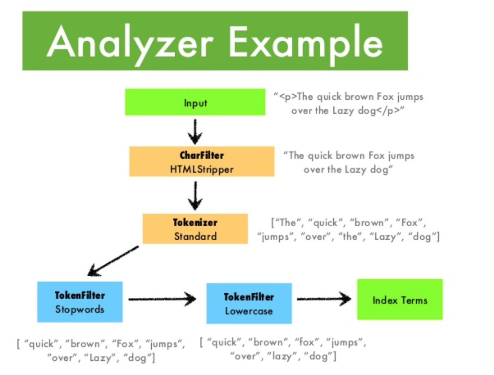

# Elasticsearch是如何工作的

## ES vs MySql
>各自长处：
>* Mysql：擅长事务类型操作，可以确保数据的安全和一致性
>* Elasticsearch：擅长海量数据的搜索、分析、计算

>概念对比

>| MySQL | Elasticsearch | 说明 |
>|:------|:-------|:------|
>| Table | Index | 索引(index)，就是文档的集合，类似数据库的表(table) |
>| Row | Document | 文档（Document），就是一条条的数据，类似数据库中的行（Row），文档都是JSON格式 |
>| Column | Field | 字段（Field），就是JSON文档中的字段，类似数据库中的列（Column）|
>| Schema | Mapping | Mapping（映射）是索引中文档的约束，例如字段类型约束。类似数据库的表结构（Schema）|
>| SQL | DSL | DSL是elasticsearch提供的JSON风格的请求语句，用来操作elasticsearch，实现CRUD |

## 文档与字段
>一个文档（Document）就像数据库里的一条数据，字段就像数据库里的列（Field）

Elasticsearch是面向文档（Document）存储的，可以是数据库中的一条商品数据，一个订单信息。文档数据会被序列化为json格式后存储在elasticsearch中。


## 索引与映射
>索引（Index）就像数据库里的表，映射（Mapping）就像数据库中定义的表结构

索引，就是相同类型的文档的集合（类似MySql中的表）。
数据库的表会有约束信息，用来定义表的结构、字段的名称、类型等信息。因此，索引库中就有映射（mapping），是索引中文档的字段约束信息，类似表的结构约束。


## 索引的CRUD

>references:

>https://www.cnblogs.com/buchizicai/p/17093719.html

>https://www.elastic.co/guide/en/elasticsearch/reference/current/indices.html

>索引CRUD例子
>* 创建索引：PUT /索引名称
>* 查询索引：GET /索引名称
>* 删除索引：DELETE /索引名称
>* 修改索引：PUT /索引名称


## 文档的CRUD
>references:

>https://www.elastic.co/guide/en/elasticsearch/reference/current/docs.html

>https://www.cnblogs.com/buchizicai/p/17093719.html

>文档CRUD例子
>* 创建文档：POST /索引名/_doc/文档id 
>* 查询文档：GET /索引名/_doc/文档id
>* 删除文档：DELETE /索引库名/_doc/文档id
>* 修改文档： 
>   * 全量修改：PUT /索引库名/_doc/文档id
>   * 增量修改：POST /索引库名/_update/文档id


## 倒排索引
>也叫倒排表，是一种典型的搜索引擎索引算法。

>references:

>https://www.cnblogs.com/buchizicai/p/17093719.html

>https://en.wikipedia.org/wiki/Search_engine_indexing

>https://en.wikipedia.org/wiki/Inverted_index

>https://www.tutorialspoint.com/difference-between-inverted-index-and-forward-index

### 倒排索引中由两个非常重要的概念：
* 文档（Document）：用来搜索的数据，其中的每一条数据就是一个文档。例如一个网页、一个商品信息
* 词条（Term）：对文档数据或用户搜索数据，利用某种算法分词，得到的具备含义的词语就是词条。例如：我是中国人，就可以分为：我、是、中国人、中国、国人这样的几个词条

### 创建倒排索引的流程
1. 将每个文档的数据进行算法分词。得到一个个词条。
2. 创建索引表，每行数据包含词条、词条所在的文档id（也可以包含词条在这个文档中出现的位置、频率）。


### 倒排索引的搜索流程
1. 用户输入条件“华为手机”进行搜索。
2. 对用户输入进行分词，得到词条“华为”“手机”。
3. 在倒排索引中查找上述词条，得到文档id：1、2、3。
4. 按照文档id去数据表中获取文档。


## 文本与分词

>references:

>https://www.cnblogs.com/buchizicai/p/17093719.html

>https://github.com/infinilabs/analysis-ik

>https://blog.csdn.net/bxg_kyjgs/article/details/130561855

>https://blog.csdn.net/ZYC88888/article/details/83620572

>https://codeshellme.github.io/2021/02/es-analyzers/

>https://cloud.tencent.com/developer/article/1850068

>将非结构化的文本（邮件内容，产品描述，网页文章等）转化为一种结构化的格式，目的是为了优化搜索。


### 分析器流程



### 标准分词器、中文分词器、自定义分词器


```
curl -X PUT "localhost:9200/my_index?pretty" -H 'Content-Type: application/json' -d'
{
    "settings":{
        "analysis":{
            "char_filter":{
                "&_to_and":{
                    "type":"mapping",
                    "mappings":[
                        "&=> and "
                    ]
                }
            },
            "filter":{
                "my_stopwords":{
                    "type":"stop",
                    "stopwords":[
                        "the",
                        "a"
                    ]
                }
            },
            "analyzer":{
                "my_analyzer":{
                    "type":"custom",
                    "char_filter":[
                        "html_strip",  // 跳过HTML标签
                        "&_to_and"  // 将&符号转换为"and"
                    ],
                    "tokenizer":"standard",
                    "filter":[
                        "lowercase",  // // 转换为小写
                        "my_stopwords"
                    ]
                }
            }
        }
    }
}
```

## 接近实时的搜索 - Near real-time search

>references:

>https://www.elastic.co/guide/en/elasticsearch/reference/current/docs-refresh.html

>https://www.elastic.co/guide/en/elasticsearch/reference/current/near-real-time.html

>https://cloud.tencent.com/developer/article/1122703

>https://juejin.cn/post/7035142136173428767

>https://m.w3cschool.cn/elasticsearchdefinitiveguidecn/tnmw1mot.html

>https://blog.csdn.net/w1014074794/article/details/119738518

>https://blog.csdn.net/hugo_lei/article/details/106519069

>https://www.xudj.top/archives/es-real-time-search

>https://www.elastic.co/guide/en/elasticsearch/reference/current/index-modules.html#index-refresh-interval-setting

>https://stackoverflow.com/questions/64328128/elasticsearch-search-with-in-near-realtime-1-sec


## 搜索

>references:

>https://www.elastic.co/guide/en/elasticsearch/reference/current/query-dsl.html

>https://www.cnblogs.com/tanghaorong/p/16297788.html#_label2

>https://www.cainiaoplus.com/elasticsearch/elasticsearch-query-dsl.html

>https://pdai.tech/md/db/nosql-es/elasticsearch-x-dsl-full-text.html

>https://blog.csdn.net/weixin_41613094/article/details/131578855

>https://blog.csdn.net/weixin_42246822/article/details/123859695

>https://www.cnblogs.com/codeshell/p/14435120.html

>https://cloud.tencent.com/developer/article/2129323

>https://cloud.tencent.com/developer/article/1694119

>https://logz.io/blog/elasticsearch-queries/

>https://www.cnblogs.com/tanghaorong/p/16297788.html

>https://www.tutorialspoint.com/elasticsearch/elasticsearch_query_dsl.htm

>https://medium.com/@princesharma_37979/mastering-elastic-dsl-essential-queries-every-elastic-developer-should-master-874f2fe5d3d0

>两种主要搜索方式：
>* 全文搜索：主要针对于需要分词的字段。
>* 关键字搜索：主要针对于不需要分词的字段。

### 全文搜索

>全文搜索的几种形式：
>* match：全文搜索的标准方式，返回所有包含词组的文档。
>* match_phrase：和match一样，但是会评估词组之间的位置。
>* multi_match：和match一样，但是会评估多个字段。
>* query_string：支持query string语法，支持与或非条件。Kibana上的查询由它实现。


#### 全文搜索 - match


### 关键字搜索

>关键词搜索的几种形式：
>* term：返回精准包含这个词组（Token，Term）的文档。
>* wildcard：这个词组是否精准匹配这个通配符模式。
>* regexp：这个词组是否精准匹配这个正则表达式。
>* range：这个词组是否位于给定的范围内，一般应用于时间、整型、浮点字段。

#### 关键词搜索 - term


#### 关键词搜索 - wildcard


#### 关键词搜索 - range


### 组合搜索


## 聚合
>references:

>https://www.cnblogs.com/tanghaorong/p/16297788.html#_label10

>https://www.elastic.co/guide/en/elasticsearch/reference/current/search-aggregations.html

>它的作用：对数据进行总结，生成指标、统计、分析。（For analysis）

它解决的问题：
* 网站的平均负载是多少？
* 根据这份商品交易数据，谁是我们最有价值的客户？
* Error、Warning级别的日志占比是多少？
* 哪个时间段是我们交易的高峰期，客户年龄段占比是多少？

它的方式：
* 指标聚合：对一大批数据的指定字段，计算其最大值、最小值、平均值、总和等指标。
* 桶聚合：根据某个字段的值（比如时间区间、年龄区间），对一大批数据进行分类。

简单来说，指标聚合为了计算某个值，桶聚合为了对数据进行分类。

### 指标聚合


### 桶聚合
 


## 分片与副本


>references:

>https://hlog.cc/archives/43/

>https://www.cnblogs.com/chenmz1995/p/12034130.html

>https://blog.csdn.net/qq_37436172/article/details/130792792

>https://juejin.cn/post/6844903862067789838

>https://doc.yonyoucloud.com/doc/mastering-elasticsearch/chapter-4/41_README.html

>https://www.cnblogs.com/-wenli/p/12763887.html

>https://blog.csdn.net/WGBLW/article/details/105482541

>https://www.baeldung.com/java-shards-replicas-elasticsearch

>https://opster.com/blogs/elasticsearch-shards-and-replicas-getting-started-guide/

>https://www.elastic.co/guide/en/elasticsearch/reference/current/docs-replication.html

>https://stackoverflow.com/questions/15694724/shards-and-replicas-in-elasticsearch

>https://www.elastic.co/cn/elasticon/conf/2016/sf/quantitative-cluster-sizing

>https://www.elastic.co/guide/en/elasticsearch/reference/current/scalability.html

>https://nidhig631.medium.com/primary-shards-replica-shards-in-elasticsearch-269343324f86

### 分片
什么是分片？
>简单来说，一个索引被分割成较小的部分，这一部分就叫分片，多个分片组成一个完整的索引。

分片有什么作用？
* 优化查询性能：查询可以同时运行在每个分片上。
* 水平扩展性：分片可以分布到各个节点，充分利用集群的资源。并且，对于新加入的节点，系统自动将某些分片转移到其上，形成资源平衡。

### 副本
什么是副本？
>简单来说，副本就是对一个分片完整的复制。一个分片可以有多个副本，副本与其分片不能位于同一个节点上。

副本有什么作用？
* 优化查询性能：同样的，查询可以同时运行在分片和副本上。
* 高可用性：由于副本与其分片位于不同的节点，如果某个节点的宕机，系统会将副本提升为分片，保障索引的可用性，提升系统的容错能力和可用性。

## 节点与集群


>references:

>https://subscription.packtpub.com/book/data/9781789957754/2/ch02lvl1sec06/elasticsearch-architectural-overview

>https://braineanear.medium.com/elasticsearch-architecture-v-node-roles-81ec3d04257e

>https://www.elastic.co/cn/blog/maximizing-elasticsearch-performance-when-adding-nodes-to-a-cluster

>https://www.haveyb.com/article/499

>https://juejin.cn/post/7038828692671299620

>https://blog.csdn.net/qq_37892675/article/details/108642114

>https://www.cnblogs.com/sparkdev/p/11044662.html

>https://blog.csdn.net/u010919083/article/details/112364257

>https://www.cnblogs.com/tanghaorong/p/16324481.html

>https://cloud.tencent.com/developer/article/2009025

>https://www.ibm.com/docs/en/storediq/7.6.0?topic=cluster-adding-removing-elasticsearch-nodes

>https://prabhjot-singh.medium.com/setup-a-multi-node-production-ready-elasticsearch-cluster-8504955f5d10

>https://stackoverflow.com/questions/71677170/how-to-know-total-nodes-in-an-elasticsearch-cluster

>https://www.instaclustr.com/blog/understanding-and-configuring-elasticsearch-node-types/

>https://www.elastic.co/guide/en/elasticsearch/reference/current/high-availability-cluster-design-large-clusters.html

>https://www.elastic.co/guide/en/elasticsearch/reference/current/high-availability-cluster-small-clusters.html

>https://learncsdesigns.medium.com/demystifying-elasticsearch-understanding-nodes-clusters-shards-and-indices-part-2-c1835e1e061e

>https://logz.io/blog/elasticsearch-cluster-tutorial/

>https://www.elastic.co/guide/en/elasticsearch/reference/current/add-elasticsearch-nodes.html

>https://www.elastic.co/guide/en/elasticsearch/reference/current/modules-node.html

>https://www.cnblogs.com/buchizicai/p/17093719.html

Master节点的作用：
* 参与集群选主。
* 管理集群状态、管理分片信息。
* 处理创建和删除索引库的请求。

Data节点的作用：
* 对文档进行增删改查操作，聚合操作。

Coordinator节点的作用：
* 接受客户请求，路由请求到其它节点。
* 合并查询到的结果，返回给用户。